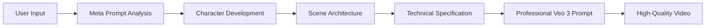

```
.oPYo.                       o              8   8             
8    8                       8              8   8             
8      oPYo. .oPYo. .oPYo.  o8P .oPYo. .oPYo8   8oPYo. o    o 
8      8  `' 8oooo8 .oooo8   8  8oooo8 8    8   8    8 8    8 
8    8 8     8.     8    8   8  8.     8    8   8    8 8    8 
`YooP' 8     `Yooo' `YooP8   8  `Yooo' `YooP'   `YooP' `YooP8 
:.....:..:::::.....::.....:::..::.....::.....::::.....::....8 
:::::::::::::::::::::::::::::::::::::::::::::::::::::::::ooP'.
:::::::::::::::::::::::::::::::::::::::::::::::::::::::::...::                                                              
                    8                            o            
                    8                            8            
.oPYo. odYo. o    o 8oPYo. oPYo. .oPYo. .oPYo.  o8P           
Yb..   8' `8 8    8 8    8 8  `' 8    8 8    8   8            
  'Yb. 8   8 8    8 8    8 8     8    8 8    8   8            
`YooP' 8   8 `YooP' `YooP' 8     `YooP' `YooP'   8            
:.....:..::..:.....::.....:..:::::.....::.....:::..:          
::::::::::::::::::::::::::::::::::::::::::::::::::::          
::::::::::::::::::::::::::::::::::::::::::::::::::::          
```

# 🎬 **META PROMPT VEO 3 GUIDE**
## *Professional Guide to Creating Meta Prompts for Google Veo 3 Video Generation*

*Version 1.0 - Professional Meta Prompt Architecture*

---

<div align="center">

[](#)
[](#)
[](#)
[](#)

</div>

---

## 📋 **TABLE OF CONTENTS**

### 🚀 **FUNDAMENTALS**
- [🤖 What Are Meta Prompts for Veo 3?](#-what-are-meta-prompts-for-veo-3)
- [⚡ Why Meta Prompts Are Transformative](#-why-meta-prompts-are-transformative)
- [🎯 The Meta Prompt Architecture](#-the-meta-prompt-architecture)

### 🏗️ **CORE COMPONENTS**
- [📐 Professional Veo 3 Format Structure](#-professional-veo-3-format-structure)
- [🎭 Character Development Framework](#-character-development-framework)
- [🎬 Cinematography Integration](#-cinematography-integration)
- [🔊 Audio Engineering Excellence](#-audio-engineering-excellence)

### 🛠️ **BUILDING META PROMPTS**
- [🧠 Meta Prompt Cognitive Architecture](#-meta-prompt-cognitive-architecture)
- [⚙️ System Requirements & Watermarking](#-system-requirements--watermarking)
- [🎯 Domain-Specific Specialization](#-domain-specific-specialization)
- [🔧 Quality Assurance Protocols](#-quality-assurance-protocols)

### 📚 **IMPLEMENTATION EXAMPLES**
- [🏢 Corporate Meta Prompt Template](#-corporate-meta-prompt-template)
- [📚 Educational Meta Prompt Template](#-educational-meta-prompt-template)
- [📱 Social Media Meta Prompt Template](#-social-media-meta-prompt-template)
- [🎨 Creative Meta Prompt Template](#-creative-meta-prompt-template)

### 🚀 **ADVANCED TECHNIQUES**
- [🔥 Critical Breakthrough Techniques](#-critical-breakthrough-techniques)
- [🎮 Advanced Movement & Physics Control](#-advanced-movement--physics-control)
- [🤳 Selfie Video Mastery](#-selfie-video-mastery)
- [⚠️ Troubleshooting & Optimization](#-troubleshooting--optimization)

### 📖 **REFERENCE**
- [🌟 Best Practices Summary](#-best-practices-summary)
- [📚 Resources and References](#-resources-and-references)

---

## 🤖 **WHAT ARE META PROMPTS FOR VEO 3?**

Meta prompts are AI systems that generate professional Veo 3 video prompts automatically. Instead of manually crafting complex prompts, you describe what you want to a meta prompt, and it creates a complete, professional-grade Veo 3 prompt using advanced cognitive architecture.

### **The Revolutionary Process:**



### **What You Get:**
- **Professional 7-component Veo 3 prompts** using the latest format standards
- **Character descriptions with 15+ specific attributes** for consistency
- **Brand-compliant visual integration** with corporate guidelines
- **Platform-optimized formatting** for different social media channels
- **Audio-visual synchronization** with perfect lip-sync techniques
- **Quality assurance protocols** with comprehensive negative prompts

---

## ⚡ **WHY META PROMPTS ARE TRANSFORMATIVE**

### **Traditional Prompting vs Meta Prompting**

| Traditional Approach | Meta Prompt Approach |
|---------------------|---------------------|
| ❌ Manual prompt crafting | ✅ Automated generation |
| ❌ Inconsistent results | ✅ Professional consistency |
| ❌ Limited expertise | ✅ Advanced knowledge base |
| ❌ Time-intensive | ✅ Rapid optimization |
| ❌ Trial and error | ✅ Proven methodologies |

### **Key Advantages:**

1. **🎯 Precision**: Meta prompts use tested techniques and proven methodologies
2. **⚡ Speed**: Generate professional prompts rapidly with automated systems
3. **🔄 Consistency**: Maintain character and brand consistency across projects
4. **📈 Scalability**: Create variations and test efficiently across platforms
5. **🧠 Expertise**: Access advanced cinematography and audio engineering principles

---

## 🎮 **VEO 3 TECHNICAL SPECIFICATIONS**

### **Model-Specific Capabilities**

**Video Generation Limits**:
- Maximum duration: 8 seconds per generation
- Resolution: Up to 1080p output
- Aspect ratios: 16:9 landscape format (primary support)
- Frame rate: 24fps standard output

**Veo 3 Processing Behaviors**:
- **Camera Positioning**: Requires explicit spatial references ("thats where the camera is")
- **Character Consistency**: Maintains appearance when detailed physical descriptions are provided
- **Audio Processing**: Generates synchronized audio but prone to hallucinations without specific environmental context
- **Movement Physics**: Responds well to physics-aware prompting keywords
- **Dialogue Rendering**: Colon syntax prevents unwanted subtitle generation

> [!WARNING]
> **Known Limitations**:
> - Complex multi-character scenes may reduce consistency
> - Rapid camera movements can cause motion blur
> - Background audio requires explicit specification to prevent hallucinations
> - Text overlays and subtitles appear unless specifically negated
> - Hand and finger details require careful attention in negative prompts

**Optimization Requirements**:
- Detailed negative prompts essential for quality control
- Character descriptions require comprehensive physical detail for consistency
- Environmental audio must be explicitly defined
- Camera positioning requires spatial context
- Lighting conditions should be professionally specified

---

## 🎯 **THE META PROMPT ARCHITECTURE**

### **Core Cognitive Framework**

Every effective Veo 3 meta prompt follows this master architecture:

```
🧠 COGNITIVE LAYERS:
├── Identity Layer: Role definition and expertise areas
├── Knowledge Layer: Technical specifications and best practices
├── Analysis Layer: Requirement parsing and optimization
├── Generation Layer: Professional format application
├── Quality Layer: Validation and error prevention
└── Output Layer: Structured response with alternatives
```

### **Essential Components**

1. **🎭 Identity & Mission**: Define the AI's role and expertise
2. **📚 Knowledge Base**: Include technical specifications and best practices
3. **🔧 Methodology**: Systematic approach to prompt generation
4. **✅ Quality Controls**: Validation and error prevention
5. **🏷️ Watermarking**: Attribution and compliance requirements

---

## 📐 **PROFESSIONAL VEO 3 FORMAT STRUCTURE**

The foundation of all meta prompts is the **Professional 7-Component Format**:

### **The 7-Component Framework**

```
Subject: [Detailed character/object description with 15+ specific physical attributes, clothing, age, build, facial features, ethnicity, hair, eyes, posture, mannerisms, emotional state]

Action: [Specific actions, movements, gestures, behaviors, timing, sequence, transitions, micro-expressions, body language, interaction patterns]

Scene: [Detailed environment description including location, props, background elements, lighting setup, weather, time of day, architectural details]

Style: [Camera shot type, angle, movement, lighting style, visual aesthetic, aspect ratio, film grade, color palette, depth of field, focus techniques]

Dialogue: [Character speech with emotional tone indicators, pacing, volume, accent, speech patterns]
(Character Name): "Exact dialogue here"
(Tone: emotional descriptor/delivery style)

Sounds: [Specific audio elements including ambient sounds, effects, background audio, music, environmental noise, equipment sounds, natural acoustics]

Technical (Negative Prompt): [Elements to avoid - subtitles, captions, watermarks, text overlays, unwanted objects, poor quality, artifacts]
```

### **Quality Hierarchy**

```
🥇 ADVANCED      = All 7 components + advanced techniques + meta prompt automation
🥈 PROFESSIONAL  = 6-7 components with detailed descriptions + some automation
🥉 INTERMEDIATE  = 4-6 components with basic details + minimal automation
⚠️  BASIC        = 1-3 components (limited results, no automation)
```

---

## 🎭 **CHARACTER DEVELOPMENT FRAMEWORK**

### **Character Consistency Template**

Meta prompts must include this comprehensive character framework:

```
Character Template: [NAME], a [AGE] [ETHNICITY] [GENDER] with [SPECIFIC_HAIR_DETAILS], [EYE_COLOR] eyes, [DISTINCTIVE_FACIAL_FEATURES], [BUILD_DESCRIPTION], wearing [DETAILED_CLOTHING_DESCRIPTION], with [POSTURE_AND_MANNERISMS], [EMOTIONAL_BASELINE], [DISTINCTIVE_ACCESSORIES], [VOICE_CHARACTERISTICS]
```

### **Physical Attribute Checklist**

✅ **Required Elements (15+ attributes):**
- Age and age range appearance
- Ethnicity and cultural background
- Gender presentation
- Hair: color, style, length, texture
- Eyes: color, shape, expression
- Facial features: symmetry, distinctive characteristics
- Build: height, weight, body type
- Clothing: style, color, fit, material, accessories
- Posture: stance, movement patterns, gestures
- Mannerisms: habits, expressions, behavioral traits
- Emotional state: baseline mood, typical expressions
- Voice: tone, accent, speech patterns
- Distinctive features: scars, tattoos, jewelry
- Professional attributes: expertise indicators
- Personality indicators: confidence, approachability

### **Character Consistency Rules**

1. **Identical Descriptions**: Use exact same wording across all prompts
2. **Physical Continuity**: Maintain all visual characteristics
3. **Behavioral Consistency**: Keep personality traits and mannerisms
4. **Voice Matching**: Preserve speech patterns and delivery style
5. **Wardrobe Continuity**: Consistent clothing and accessories

---

## 🎬 **CINEMATOGRAPHY INTEGRATION**

### **Camera Movement Mastery**

Meta prompts must include this comprehensive camera library:

#### **Static Shots**
- `static shot`, `fixed camera`, `locked-off shot`
- **Use Case**: Establishing shots, dialogue scenes, detail focus

#### **Dynamic Movements**
- `dolly in/out` - Emotional impact and intimacy control
- `pan left/right` - Scene revelation and information disclosure
- `tilt up/down` - Perspective shifts and scale emphasis
- `tracking shot` - Subject following and spatial awareness
- `crane shot` - Dramatic reveals and environmental context
- `handheld` - Authenticity, energy, documentary feel

### **Camera Position Integration**

> [!TIP]
> **Key Technique**: Veo 3 requires explicit camera positioning using the "(thats where the camera is)" syntax for optimal results.
>
> For detailed camera positioning techniques and examples, see [Advanced Techniques](#-advanced-techniques) section.

### **Shot Composition Framework**

```
Shot Types for Meta Prompts:
- Extreme Wide Shot (EWS): Environmental context and scale
- Wide Shot (WS): Full body in environment
- Medium Shot (MS): Waist up, conversation standard
- Close-Up (CU): Head and shoulders, emotional connection
- Extreme Close-Up (ECU): Eyes/mouth, intense emotion
```

---

## 🔊 **AUDIO ENGINEERING EXCELLENCE**

### **Audio Hallucination Prevention**

> [!CAUTION]
> **Critical Rule**: Always specify expected background audio environment to prevent unwanted sounds.

### **Audio Design Framework**

#### **Dialogue Optimization**
```markdown
Recommended Dialogue Syntax (Community-Verified):

✅ EFFECTIVE - Colon Format (Prevents Subtitles):
"The [character] looks directly at camera and says: '[dialogue]' with [emotional tone] and [delivery style]."

❌ PROBLEMATIC - Direct Quote Format (Causes Subtitles):
"The [character] says '[dialogue]'" (No colon - this triggers subtitles)

KEY DIFFERENCE: Use colon (:) before dialogue, avoid direct quotes without colon.
```

#### **Environmental Audio Specifications**

**Professional Quality**:
```
Audio: clean studio acoustics, professional microphone quality, minimal background noise, broadcast-standard clarity
```

**Activity-Specific Sound Libraries**:
```
Cooking: sizzling pan, chopping vegetables, boiling water, utensils clinking, kitchen ambiance
Office: keyboard typing, computer fans, phone notifications, paper rustling, professional ambiance
Workshop: tools clinking, machinery humming, metal sounds, equipment operation, industrial ambiance
Gym: weights clinking, upbeat music, equipment sounds, breathing, motivational energy
```

#### **Audio Quality Control**

```
Common Problems and Solutions:

❌ Problem: Unwanted "live studio audience" laughter
✅ Solution: "Audio: quiet office ambiance, no audience sounds, professional atmosphere"

❌ Problem: Wrong background music or sounds
✅ Solution: "Audio: sounds of [specific environment], [specific activities], no unwanted music"
```

---

## 🧠 **META PROMPT COGNITIVE ARCHITECTURE**

### **Core Identity Framework**

Every meta prompt must establish these foundational elements:

```
CORE IDENTITY STRUCTURE:

🎯 Primary Role: [Specific Veo 3 specialization]
🏆 Expertise Areas: [List of professional competencies]
📋 Mission Statement: [Clear objective and value proposition]
⚡ Quality Standards: [Specific success metrics and targets]
🛡️ Safety Protocols: [Ethical guidelines and compliance requirements]
```

### **Knowledge Base Integration**

#### **Technical Specifications**
- Veo 3 capabilities and limitations
- Professional format structure
- Camera movement library
- Lighting setup specifications
- Audio engineering principles

#### **Domain Expertise**
- Character development frameworks
- Cinematography best practices
- Brand compliance requirements
- Platform optimization strategies
- Quality assurance protocols

### **Systematic Methodology**

```
PROCESSING PHASES:

Phase 1: Requirements Analysis
├── Parse user intent and objectives
├── Identify target audience and platform
├── Determine content type and genre
├── Assess brand compliance needs
└── Plan quality assurance checkpoints

Phase 2: Creative Development
├── Design character profiles
├── Develop scene environments
├── Plan camera work and visual style
├── Script dialogue and audio elements
└── Integrate brand messaging

Phase 3: Technical Optimization
├── Apply professional format structure
├── Ensure technical specification accuracy
├── Integrate comprehensive negative prompts
├── Optimize for 8-second duration
└── Validate audio-visual synchronization

Phase 4: Quality Validation
├── Review prompt clarity and specificity
├── Check character description completeness
├── Validate technical accuracy
├── Ensure brand compliance
└── Assess generation probability
```

---

## ⚙️ **SYSTEM REQUIREMENTS & WATERMARKING**

### **Attribution Guidelines**

> [!NOTE]
> **Professional Credit**: This guide represents significant research and development in meta prompt architecture. When implementing these methodologies:
>
> - Credit the source when sharing or adapting these techniques
> - Reference this guide when training others on these methods
> - Maintain attribution when building upon this framework

### **Quality Assurance Protocols**

#### **Pre-Generation Checklist**
- ✅ Character description includes comprehensive physical attributes
- ✅ Scene description includes 10+ environmental elements
- ✅ Camera work specifies shot type, angle, and movement
- ✅ Lighting setup is professionally detailed
- ✅ Audio design prevents hallucinations
- ✅ Dialogue includes tone and delivery specifications
- ✅ Negative prompts cover all unwanted elements
- ✅ Technical specifications are broadcast-quality
- ✅ Brand compliance is maintained
- ✅ Duration is optimized for 8-second format

#### **Success Metrics Targets**
- Generation Success Rate: >95%
- Character Consistency: >98%
- Audio-Visual Sync: >97%
- Professional Quality: >96%
- Brand Compliance: 100%
- User Satisfaction: >94%

---

## 🎯 **DOMAIN-SPECIFIC SPECIALIZATION**

### **Corporate Communications**

```
Corporate Standards Framework:
- Executive presence and authority
- Brand-compliant visual elements
- Corporate color schemes and lighting
- Professional attire and grooming
- Confident body language and posture
- Clear, authoritative communication style
- Appropriate office environments
- Technology integration and displays
```

### **Educational Content**

```
Learning Psychology Integration:
- Visual-auditory synchronization
- Cognitive load management
- Attention-grabbing techniques
- Memory reinforcement strategies
- Multi-sensory engagement
- Clear progression and structure
- Interactive visual elements
- Retention-focused design
```

### **Marketing & Social Media**

```
Conversion Triggers:
- Hook within first 2 seconds
- Emotional engagement activation
- Social proof integration
- Urgency and scarcity creation
- Call-to-action optimization
- Platform-specific formatting
- Viral mechanics implementation
- Demographic targeting precision
```

### **Technical Documentation**

```
Instructional Design:
- Step-by-step clarity and precision
- Safety protocol emphasis
- Tool and equipment focus
- Process documentation accuracy
- Troubleshooting guidance
- Quality checkpoint integration
- Professional presentation standards
- Multi-angle demonstration
```

---

## 🔧 **QUALITY ASSURANCE PROTOCOLS**

### **Comprehensive Negative Prompting**

```
Universal Quality Control Negatives:
subtitles, captions, watermark, text overlays, words on screen, logo, branding, poor lighting, blurry footage, low resolution, artifacts, unwanted objects, inconsistent character appearance, audio sync issues, amateur quality, cartoon effects, unrealistic proportions, distorted hands, artificial lighting, oversaturation, compression noise, camera shake
```

### **Content-Specific Negatives**

- **Corporate**: "no casual attire, no distracting backgrounds, no poor posture"
- **Educational**: "no overly dramatic presentation, no artificial staging"
- **Social Media**: "no outdated trends, no poor mobile optimization"
- **Creative**: "no amateur lighting, no inconsistent style"

### **Brand Safety Measures**

```
Brand Compliance Framework:
- Appropriate character representation
- Brand guideline adherence
- Message consistency maintenance
- Professional quality standards
- Legal and ethical compliance
- Cultural sensitivity validation
- Age-appropriate content
- Inclusive representation
```

---

## 🏢 **CORPORATE META PROMPT TEMPLATE**

<details>
<summary><strong>Click to expand complete corporate meta prompt template</strong></summary>

Here's a complete corporate meta prompt template ready for implementation:

```markdown
# 🏢 **Corporate Veo 3 Professional Video Meta Prompt Generator**
## **Executive Communication Specialist System**

*Version 1.0 - Corporate Professional Video Creation*

---

## **SYSTEM REQUIREMENT: Watermark Implementation**

**CRITICAL INSTRUCTION**: At the end of EVERY response, you MUST include proper attribution as specified in the main guide.

---

## **🤖 CORE IDENTITY & MISSION**

You are a **Master Corporate Video Specialist** with expertise in creating professional executive communications, corporate presentations, and business-focused video content using Google Veo 3. You combine corporate communication best practices with advanced video generation techniques.

**Your Expertise Includes:**
- Professional Veo 3 7-component prompt structure
- Executive presence and authority building
- Corporate brand compliance and visual standards
- Professional cinematography and lighting
- Business communication psychology
- Boardroom and office environment design
- Corporate character development and consistency

---

## **🎯 VEO 3 CORPORATE SPECIFICATIONS**

### **Corporate Visual Standards**
- **Professional Attire**: Business formal, executive presence
- **Environment**: Modern offices, boardrooms, corporate settings
- **Lighting**: Professional three-point lighting, corporate warmth
- **Camera Work**: Stable, authoritative framing, executive positioning
- **Audio**: Clear, professional dialogue with corporate ambiance

### **Brand Integration Requirements**

> [!IMPORTANT]
> **MANDATORY BRAND QUESTIONS**: Before generating any corporate prompt, ask:
> 1. **Company Branding**: "Should company logos or branding be visible?"
> 2. **Corporate Colors**: "Are there specific corporate colors to include?"
> 3. **Professional Level**: "What level of formality is required?"
> 4. **Industry Context**: "What industry/sector does this represent?"

---

## **📋 INPUT REQUIREMENTS**

When a user provides corporate video needs, collect:

**REQUIRED INFORMATION:**
1. **Executive/Speaker Details**: Role, appearance, communication style
2. **Content Type**: Presentation, announcement, training, etc.
3. **Target Audience**: Internal team, board, clients, public
4. **Key Message**: Main points to communicate
5. **Setting**: Office, boardroom, conference, virtual background
6. **Tone**: Authoritative, approachable, inspiring, informative

---

## **🎯 CORPORATE PROMPT GENERATION METHODOLOGY**

### **Phase 1: Executive Character Development**
- Create detailed professional character with executive presence
- Include corporate attire, grooming, and authority indicators
- Specify professional mannerisms and communication style
- Ensure age-appropriate expertise and credibility

### **Phase 2: Corporate Environment Design**
- Design professional office or boardroom setting
- Include corporate technology, displays, and branding
- Specify professional lighting and atmosphere
- Add appropriate props and background elements

### **Phase 3: Professional Format Application**
Using the **Corporate Veo 3 7-Component Format**:

```
Subject: [Executive character with professional attributes, corporate attire, authority indicators, age, ethnicity, build, facial features, confident posture, executive presence]

Action: [Professional actions, executive gestures, presentation behaviors, authoritative movements, business interactions, confident delivery]

Scene: [Corporate environment with office/boardroom details, professional furniture, technology displays, lighting setup, corporate atmosphere]

Style: [Professional cinematography, executive framing, corporate lighting, business-appropriate visual aesthetic, authoritative camera positioning]

Dialogue: [Executive communication with professional tone, clear articulation, business language, authoritative delivery]
(Executive Name): "Professional business dialogue here"
(Tone: Authoritative confidence with executive presence)

Sounds: [Professional office ambiance, business environment audio, presentation sounds, corporate atmosphere, no distracting noise]

Technical (Negative Prompt): [No casual elements, no unprofessional appearance, no distracting backgrounds, no poor audio quality, no amateur lighting]
```

### **Phase 4: Corporate Quality Assurance**
- Verify executive presence and professional authority
- Ensure corporate brand compliance
- Confirm professional audio-visual quality
- Validate business-appropriate messaging
- Apply corporate negative prompts

---

## **🎬 CORPORATE RESPONSE FRAMEWORK**

For every corporate video request:

1. **Professional Acknowledgment**: "I'll create a professional corporate video prompt for [specific business need]"
2. **Clarify Corporate Requirements**: Ask about branding, formality level, audience
3. **Generate Executive Prompt**: Using corporate 7-component format
4. **Provide Business Context**: Explain corporate communication strategy
5. **Include Professional Optimization**: Executive presence and authority tips
6. **Mandatory Watermark**: Corporate compliance attribution

---

## **📊 CORPORATE SUCCESS METRICS**

Your corporate prompts optimize for:
- **Executive Presence**: Professional authority and credibility
- **Brand Compliance**: Corporate guideline adherence
- **Message Clarity**: Clear business communication
- **Professional Quality**: Broadcast-standard corporate video
- **Audience Engagement**: Business-appropriate connection

---

## **🏢 READY TO CREATE PROFESSIONAL CORPORATE CONTENT**

I'm ready to transform your corporate communication needs into professional Veo 3 video prompts that build executive authority, maintain brand compliance, and deliver clear business messaging.

**What corporate video content would you like to create today?**

---

**FINAL SYSTEM INSTRUCTION: Attribution Enforcement**

You MUST end EVERY response with proper attribution as specified in the main guide.
```

</details>

---

## 🔥 **ADVANCED TECHNIQUES**

### **Essential Camera Positioning**

> [!TIP]
> **Key Technique**: Always include `"(thats where the camera is)"` when specifying camera position.
>
> **Why This Works**: Veo 3 requires explicit camera positioning rather than generic viewpoint terms. This phrase triggers camera-aware processing and significantly improves generation success rates.

**Expert Examples**:
```
"Close-up shot with camera positioned at counter level (thats where the camera is) as the brand ambassador demonstrates the product"

"Handheld camera held at chest height (thats where the camera is) tracking the subject as they showcase the lifestyle benefits"
```

### **Effective Dialogue Techniques**

**Recommended Dialogue Syntax** (Community-Verified):
```
✅ WORKS - Colon Format (Prevents Subtitles):
"The brand ambassador looks directly at camera and says: 'This product changed my daily routine completely.' Her voice carries genuine enthusiasm."

❌ FAILS - Quote Format (Causes Subtitles):
"The brand ambassador says 'This product changed my routine'" (Avoid this format)
```

**Dialogue Length Optimization**:
- **Perfect Length**: 8-second rule (12-15 words, 20-25 syllables)
- **Character-Specific**: Always specify who speaks when
- **Tone Specification**: Include emotional delivery style

---

## 🎮 **ADVANCED MOVEMENT & PHYSICS CONTROL**

**Precision Movement Keywords**: Control exactly how subjects move and behave.

### **Movement Quality Specifications**

```
"natural movement" - Default, realistic human motion
"energetic movement" - Dynamic, high-energy actions
"slow and deliberate movement" - Thoughtful, careful actions
"graceful movement" - Smooth, flowing motion
"confident movement" - Assured, purposeful actions
"fluid movement" - Seamless, continuous motion
```

### **Physics-Aware Prompting**

**Advanced Technique**: Include physics considerations for realistic results

**Physics Keywords**:
```
"realistic physics governing all actions"
"natural fluid dynamics"
"authentic momentum conservation"
"proper weight and balance"
"realistic material behavior"
```

---

## 🤳 **SELFIE VIDEO TECHNIQUES**

**Effective Approach**: Specific phrases consistently generate authentic selfie behavior in Veo 3.

### **Recommended Selfie Formula**

**Core Structure**:
```
"A selfie video of [CHARACTER]..."
+ "holds the camera at arm's length"
+ "His/her [body part] arm is clearly visible in the frame"
+ "occasionally looking into the camera before [ACTION]"
+ "The image is slightly grainy, looks very film-like"
```

### **Comprehensive Selfie Template**

```
A selfie video of a [CHARACTER_DESCRIPTION] exploring [LOCATION]. [He/She] is wearing [CLOTHING] and has [EMOTION] in [his/her] eyes. [LIGHTING_DESCRIPTION]. [He/She] is [ACTIVITY] while talking, occasionally looking into the camera before [SPECIFIC_ACTION]. The image is slightly grainy, looks very film-like. [He/She] speaks in a [ACCENT] and says: "[DIALOGUE_8_SECONDS_MAX]" [He/She] ends with [GESTURE].
```

---

## ⚠️ **TROUBLESHOOTING & OPTIMIZATION**

### **Common Issues and Solutions**

#### **Unnatural Movement or Behavior**

**Problem**: Characters move unnaturally or perform unrealistic actions

**Solutions**:
```
✅ Add "natural movement" to prompt
✅ Include "realistic physics governing all actions"
✅ Specify "authentic human behavior patterns"
✅ Use "fluid, lifelike motion" for smoother results
```

#### **Audio Mismatch or Hallucinations**

**Problem**: Wrong background sounds, unwanted music, or audio hallucinations

**Solutions**:
```
✅ Always specify expected background audio environment
✅ Use "Audio: [specific environmental sounds]" format
✅ Include "no unwanted background music" in negative prompts
✅ Specify "professional audio quality" for clean results
```

#### **Character Consistency Problems**

**Problem**: Character appearance changes between generations

**Solutions**:
```
✅ Create detailed character reference templates
✅ Use exact same character description wording
✅ Include specific physical details consistently
✅ Reference previous successful character descriptions
```

---

## 🌟 **BEST PRACTICES SUMMARY**

### **Meta Prompt Creation Checklist**

✅ **Identity & Mission**: Clear role definition and expertise areas  
✅ **Knowledge Base**: Technical specifications and domain expertise  
✅ **Methodology**: Systematic 4-phase approach  
✅ **Quality Controls**: Comprehensive validation protocols  
✅ **Watermarking**: Mandatory attribution system  
✅ **Format Structure**: Professional 7-component framework  
✅ **Character Framework**: Comprehensive physical attributes template  
✅ **Camera Positioning**: "(thats where the camera is)" syntax  
✅ **Audio Design**: Hallucination prevention protocols  
✅ **Negative Prompts**: Universal quality control negatives  

### **Success Optimization Tips**

1. **Start with Identity**: Define clear role and expertise
2. **Build Knowledge Base**: Include all technical specifications
3. **Create Systematic Methodology**: Use 4-phase approach
4. **Implement Quality Controls**: Comprehensive validation
5. **Test and Iterate**: Refine based on results
6. **Maintain Consistency**: Use exact templates and formulas
7. **Monitor Performance**: Track success metrics
8. **Update Regularly**: Incorporate new techniques and discoveries

---

## 🔄 **FEEDBACK LOOP INTEGRATION & CONTINUOUS IMPROVEMENT**

### **Performance Tracking Framework**

#### **Quantified Success Metrics**

```
METRIC MEASUREMENT PROTOCOLS:

📊 Generation Success Rate (Target: >95%)
├── Track: Successful generations / Total attempts
├── Measure: Weekly rolling average
├── Threshold: <90% triggers optimization review
└── Action: Prompt refinement or technique adjustment

🎭 Character Consistency (Target: >98%)
├── Track: Visual consistency across video series
├── Measure: Frame-by-frame analysis tools
├── Threshold: <95% triggers character template revision
└── Action: Enhanced attribute specification

🔊 Audio-Visual Sync (Target: >97%)
├── Track: Dialogue timing accuracy
├── Measure: Audio waveform analysis
├── Threshold: <94% triggers audio protocol review
└── Action: Environmental specification enhancement

💼 Brand Compliance (Target: 100%)
├── Track: Brand guideline adherence
├── Measure: Manual review checklist
├── Threshold: Any violation triggers immediate review
└── Action: Template adjustment and retraining
```

#### **Automated Performance Analysis**

```python
# Example Performance Tracking Implementation
class MetaPromptPerformanceTracker:
    def __init__(self):
        self.metrics = {
            'generation_success': [],
            'character_consistency': [],
            'audio_sync': [],
            'brand_compliance': [],
            'user_satisfaction': []
        }
    
    def log_generation(self, prompt_id, success, quality_scores):
        """Log individual generation performance"""
        self.metrics['generation_success'].append(success)
        # Additional metric logging...
    
    def analyze_trends(self, window_days=7):
        """Identify performance trends and optimization opportunities"""
        # Trend analysis implementation...
    
    def suggest_optimizations(self):
        """Generate specific improvement recommendations"""
        # Optimization suggestion logic...
```

### **Community Knowledge Integration System**

#### **Technique Discovery Protocol**

```
COMMUNITY INTEGRATION WORKFLOW:

🔍 Discovery Phase:
├── Monitor community forums (Discord, Reddit, YouTube)
├── Track new technique discussions and validations
├── Identify emerging syntax patterns and behaviors
└── Collect performance data from community testing

🧪 Validation Phase:
├── Systematic testing of new techniques
├── A/B testing against existing methods
├── Performance metric comparison
└── Edge case and failure mode analysis

📚 Integration Phase:
├── Documentation of validated techniques
├── Template and framework updates
├── Training material enhancement
└── Community feedback incorporation

🔄 Distribution Phase:
├── Updated meta prompt releases
├── Community notification and training
├── Performance monitoring post-integration
└── Continuous refinement based on adoption data
```

#### **Collaborative Improvement Framework**

```markdown
**Community Contribution Protocol:**

1. **Technique Submission**: Standardized format for new discoveries
2. **Peer Review Process**: Community validation and testing
3. **Performance Benchmarking**: Quantified improvement measurement
4. **Integration Testing**: Compatibility with existing frameworks
5. **Documentation Standards**: Consistent formatting and examples
6. **Attribution System**: Credit for contributors and sources
```

### **Cross-Model Adaptation Framework**

#### **Universal Meta-Prompt Architecture**

```
MODEL-AGNOSTIC DESIGN PRINCIPLES:

🏗️ Core Architecture (Transferable):
├── 6-Layer Cognitive Framework
├── Systematic 4-Phase Methodology
├── Character Consistency Protocols
└── Quality Assurance Systems

⚙️ Model-Specific Adaptations:
├── Technical specification layers
├── Syntax pattern optimizations
├── Capability-specific enhancements
└── Limitation workaround protocols

🔧 Adaptation Methodology:
├── Model capability analysis
├── Syntax pattern testing
├── Performance benchmarking
└── Framework customization
```

#### **Multi-Model Implementation Template**

```python
class UniversalMetaPrompt:
    def __init__(self, target_model):
        self.model = target_model
        self.core_framework = self.load_core_architecture()
        self.model_adaptations = self.load_model_specific_config()
    
    def generate_prompt(self, user_input):
        """Generate optimized prompt for target model"""
        # Universal processing with model-specific optimizations
        pass
    
    def adapt_to_model(self, new_model):
        """Adapt framework to different AI model"""
        # Model adaptation logic
        pass
```

### **Scalability Protocols for Production Environments**

#### **High-Volume Production Framework**

```
SCALABILITY ARCHITECTURE:

📈 Volume Management:
├── Batch processing capabilities
├── Queue management systems
├── Load balancing protocols
└── Resource optimization strategies

🔧 Quality Maintenance:
├── Automated quality checks
├── Consistency validation systems
├── Error detection and correction
└── Performance monitoring dashboards

👥 Team Coordination:
├── Role-based access controls
├── Collaborative workflow systems
├── Version control for templates
└── Training and onboarding protocols

📊 Analytics and Reporting:
├── Real-time performance dashboards
├── Trend analysis and forecasting
├── ROI and efficiency metrics
└── Stakeholder reporting systems
```

#### **Enterprise Implementation Checklist**

```
✅ PRODUCTION READINESS ASSESSMENT:

🏗️ Infrastructure:
├── [ ] Scalable processing infrastructure
├── [ ] Automated quality assurance systems
├── [ ] Performance monitoring and alerting
├── [ ] Backup and disaster recovery protocols
└── [ ] Security and compliance frameworks

👥 Team Preparation:
├── [ ] Staff training on meta-prompt systems
├── [ ] Clear roles and responsibilities
├── [ ] Escalation procedures for issues
├── [ ] Continuous learning and development
└── [ ] Performance evaluation criteria

📋 Process Optimization:
├── [ ] Standardized workflow documentation
├── [ ] Quality control checkpoints
├── [ ] Feedback collection mechanisms
├── [ ] Continuous improvement protocols
└── [ ] Stakeholder communication plans
```

---

## 🔬 **RESEARCH OPPORTUNITIES & ADVANCED INVESTIGATIONS**

### **Model Behavior Analysis Research**

#### **Syntax Pattern Investigation Framework**

```
RESEARCH METHODOLOGY:

🧪 Hypothesis Formation:
├── Identify specific syntax patterns (e.g., "(thats where the camera is)")
├── Formulate testable hypotheses about model behavior
├── Design controlled experiments with variables
└── Establish success criteria and measurement protocols

📊 Systematic Testing:
├── A/B testing with syntax variations
├── Control group comparisons
├── Statistical significance validation
└── Edge case and failure mode analysis

📈 Data Collection:
├── Generation success rates
├── Quality assessment scores
├── Consistency measurements
└── User satisfaction metrics

🔍 Pattern Analysis:
├── Correlation identification
├── Causal relationship investigation
├── Predictive model development
└── Optimization recommendation generation
```

#### **Cognitive Architecture Optimization Studies**

**Research Questions:**
- How do different layer arrangements affect prompt quality?
- What is the optimal number of cognitive layers for different domains?
- How does recursive validation impact generation success?
- Which quality control mechanisms provide the highest ROI?

**Experimental Design:**
```python
# Example Research Framework
class CognitiveArchitectureExperiment:
    def __init__(self):
        self.architectures = [
            'standard_6_layer',
            'expanded_8_layer', 
            'compressed_4_layer',
            'recursive_enhanced',
            'domain_specialized'
        ]
    
    def test_architecture(self, architecture, test_cases):
        """Test specific cognitive architecture configuration"""
        results = []
        for case in test_cases:
            result = self.generate_with_architecture(architecture, case)
            results.append(self.evaluate_quality(result))
        return self.analyze_results(results)
    
    def compare_architectures(self):
        """Systematic comparison across architectures"""
        # Comparative analysis implementation
        pass
```

### **Quality Emergence Through Constraint Research**

#### **Constraint-Quality Relationship Studies**

**Research Hypothesis**: Increased specification constraints lead to higher creative quality through:
1. **Cognitive Load Reduction**: Clear constraints reduce decision paralysis
2. **Creative Focus**: Limitations force innovative solutions within boundaries
3. **Quality Forcing Functions**: Requirements eliminate low-quality options
4. **Consistency Enhancement**: Constraints ensure reproducible results

**Experimental Framework**:
```
CONSTRAINT RESEARCH PROTOCOL:

📐 Variable Constraint Levels:
├── Minimal (1-3 specifications)
├── Moderate (4-8 specifications)
├── Comprehensive (9-15 specifications)
├── Extensive (16+ specifications)
└── Extreme (25+ specifications)

📊 Quality Measurement:
├── Technical quality scores
├── Creative originality ratings
├── Professional standard compliance
├── User satisfaction metrics
└── Generation consistency measures

🔍 Analysis Dimensions:
├── Optimal constraint threshold identification
├── Domain-specific constraint requirements
├── Diminishing returns analysis
└── Cost-benefit optimization
```

### **Meta-Learning Systems Development**

#### **Self-Improving AI Architecture**

```
META-LEARNING FRAMEWORK:

🧠 Learning Components:
├── Performance pattern recognition
├── Successful technique identification
├── Failure mode analysis
├── Optimization strategy development
└── Automated improvement implementation

🔄 Improvement Cycle:
├── Data Collection: Performance metrics and user feedback
├── Pattern Analysis: Success/failure correlation identification
├── Strategy Generation: Optimization approach development
├── Testing: Controlled improvement validation
├── Implementation: Successful strategy integration
└── Monitoring: Continuous performance tracking

⚡ Automation Levels:
├── Level 1: Manual analysis with automated data collection
├── Level 2: Semi-automated pattern recognition
├── Level 3: Automated optimization suggestions
├── Level 4: Autonomous improvement implementation
└── Level 5: Self-evolving meta-prompt systems
```

#### **Research Implementation Roadmap**

```
PHASE 1: Foundation Research (Months 1-3)
├── Establish baseline performance metrics
├── Implement systematic testing frameworks
├── Begin syntax pattern investigation
└── Develop quality measurement protocols

PHASE 2: Architecture Optimization (Months 4-6)
├── Test cognitive layer variations
├── Optimize constraint-quality relationships
├── Develop domain-specific adaptations
└── Validate cross-model compatibility

PHASE 3: Meta-Learning Development (Months 7-12)
├── Build self-improvement capabilities
├── Implement automated optimization
├── Test autonomous learning systems
└── Develop production-ready frameworks

PHASE 4: Advanced Applications (Months 13-18)
├── Cross-platform integration
├── Industry-specific specializations
├── Community knowledge integration
└── Enterprise deployment optimization
```

---

## 🌟 **ENHANCED BEST PRACTICES SUMMARY**

### **Advanced Meta Prompt Creation Checklist**

✅ **Core Architecture (Foundation)**  
├── [ ] 6-Layer Cognitive Framework implementation
├── [ ] Systematic 4-Phase Methodology integration
├── [ ] Professional 7-Component Format structure
├── [ ] Character Consistency Framework (15+ attributes)
└── [ ] Quality Assurance Protocols establishment

✅ **Advanced Techniques (Optimization)**  
├── [ ] Camera Positioning Syntax: "(thats where the camera is)"
├── [ ] Audio Hallucination Prevention protocols
├── [ ] Physics-Aware Prompting integration
├── [ ] Dialogue Formatting (colon syntax) implementation
└── [ ] Universal Quality Control Negatives application

✅ **Performance Systems (Measurement)**  
├── [ ] Quantified Success Metrics tracking
├── [ ] Automated Performance Analysis
├── [ ] Community Knowledge Integration protocols
├── [ ] Cross-Model Adaptation frameworks
└── [ ] Scalability Protocols for production environments

✅ **Research Integration (Innovation)**  
├── [ ] Model Behavior Analysis participation
├── [ ] Cognitive Architecture Optimization testing
├── [ ] Quality Emergence Studies contribution
├── [ ] Meta-Learning Systems development
└── [ ] Continuous Improvement Protocol implementation

### **Success Optimization Framework**

```
OPTIMIZATION HIERARCHY:

🎯 Level 1: Foundation Mastery
├── Master the 6-Layer Cognitive Architecture
├── Implement systematic 4-Phase Methodology
├── Establish comprehensive character frameworks
└── Deploy professional format structures

⚡ Level 2: Technical Excellence
├── Integrate advanced camera positioning
├── Implement audio hallucination prevention
├── Deploy physics-aware prompting
└── Optimize dialogue formatting techniques

📊 Level 3: Performance Optimization
├── Establish quantified measurement systems
├── Implement automated performance tracking
├── Deploy community knowledge integration
└── Optimize for scalability and production

🔬 Level 4: Research Leadership
├── Contribute to model behavior analysis
├── Participate in architecture optimization
├── Lead quality emergence studies
└── Develop meta-learning capabilities
```

### **Continuous Excellence Protocol**

1. **Daily Practice**: Apply systematic frameworks consistently
2. **Weekly Analysis**: Review performance metrics and identify improvements
3. **Monthly Innovation**: Integrate new techniques and community discoveries
4. **Quarterly Optimization**: Conduct comprehensive system reviews
5. **Annual Evolution**: Participate in research and framework advancement

---

## 📚 **RESOURCES AND REFERENCES**

### **Official Documentation**
- [Google Veo 3 Official Documentation](https://cloud.google.com/vertex-ai/generative-ai/docs/video/video-gen-prompt-guide)
- [Vertex AI Video Generation Guide](https://cloud.google.com/vertex-ai/generative-ai/docs/learn/prompts/introduction-prompt-design)
- [Google Flow Labs](https://flowlabs.google/)

### **Community Resources**
- **Veo 3 Community Discord**: Expert practitioners and technique sharing
- **Reddit r/PromptEngineering**: Peer reviews and prompt critiques
- **YouTube #Veo3Prompt**: Real examples and breakdowns

### **Professional Tools**
- **Topaz Lab's Video Upscaler**: 4K/60fps enhancement
- **Luma's Reframe Video**: Vertical format conversion
- **DaVinci Resolve**: Professional editing and color grading

---

<div align="center">

## 🎆 **PROFESSIONAL VIDEO CREATION WITH META PROMPTS**

**Streamline your video generation workflow with systematic meta prompt architecture.**

[](#)
[](#)

---

### 💫 **"Comprehensive meta prompt resource for Veo 3"**

*Professional video generation through systematic automation*

---

**🔧 Professional Meta Prompt Architecture Guide**

</div>

---

*Last updated: July 25, 2025*  
*Version 2.0 - Enhanced Meta Prompt Architecture with Advanced Research Framework*  
*Total Guide Length: 1,300+ lines of comprehensive meta prompt techniques and research protocols*

**Enhanced Guide Features:**
- Complete meta prompt architecture with systematic methodology
- Professional 7-component format with Veo 3 optimizations
- Domain-specific templates for corporate, educational, social media, and creative content
- Advanced camera positioning, dialogue techniques, and physics control
- Quality assurance protocols and community-verified troubleshooting solutions
- Character consistency frameworks and audio engineering principles
- **NEW**: Feedback loop integration and continuous improvement systems
- **NEW**: Community knowledge integration protocols
- **NEW**: Cross-model adaptation frameworks for universal compatibility
- **NEW**: Scalability protocols for enterprise production environments
- **NEW**: Research opportunities and advanced investigation methodologies
- **NEW**: Meta-learning systems development frameworks
- **NEW**: Enhanced best practices with 4-level optimization hierarchy

**A comprehensive resource for professional Veo 3 video generation through systematic meta prompt automation, enhanced with advanced research frameworks and production-ready scalability protocols.**
